# Taller 2 - Pruebas y Lanzamiento (CircleGuard)

| Campo | Valor |
|---|---|
| Estudiante | Juan David Acevedo |
| Codigo | 1109115477 |
| Repositorio | https://github.com/ItsJuanda17/Taller-2-INGSOFTV |
| Repositorio fuente del taller | https://github.com/jcmunozf/circle-guard-public |
| Microservicios cubiertos | auth, identity, promotion, dashboard, gateway, notification |
| Cluster | docker-desktop con Kubernetes de Docker Desktop |
| Namespace | circleguard |
| Fecha | 2026-05-09 |

---

## Tabla de contenidos

1. [Setup de infraestructura (Punto 1 - 10%)](#1-setup-de-infraestructura-punto-1---10)
2. [Pipeline DEV (Punto 2 - 15%)](#2-pipeline-dev-punto-2---15)
3. [Pruebas: unit, integration, E2E y performance (Punto 3 - 30%)](#3-pruebas-unit-integration-e2e-y-performance-punto-3---30)
4. [Pipeline STAGE (Punto 4 - 15%)](#4-pipeline-stage-punto-4---15)
5. [Pipeline MASTER y release notes (Punto 5 - 15%)](#5-pipeline-master-y-release-notes-punto-5---15)
6. [Documentacion y video (Punto 6 - 15%)](#6-documentacion-y-video-punto-6---15)
7. [Apendice: decisiones tecnicas y bugs encontrados](#apendice-decisiones-tecnicas-y-bugs-encontrados)

---

## 1. Setup de infraestructura (Punto 1 - 10%)

La infraestructura se levanto de forma local sobre Docker Desktop con Kubernetes habilitado. Jenkins se ejecuto como contenedor dentro del mismo entorno, compartiendo el socket de Docker y el acceso al cluster para construir imagenes y desplegarlas sin usar un registry intermedio.

| Componente | Estado | Acceso o verificacion |
|---|---|---|
| Docker | Docker Desktop con contenedores Linux | docker ps |
| Kubernetes | Cluster docker-desktop con el nodo desktop-control-plane en Ready | kubectl get nodes |
| Jenkins | Instancia LTS con plugins de Pipeline y Git | http://localhost:8080 |
| Namespace de la aplicacion | circleguard | kubectl -n circleguard get all |
| Middleware | Postgres, Neo4j, Kafka, Zookeeper y Redis desplegados como servicios internos | mismo namespace |

Los manifiestos usados quedaron en [infra/k8s](../../infra/k8s/), con la separacion habitual entre namespace, configuracion compartida, middleware y servicios por microservicio.

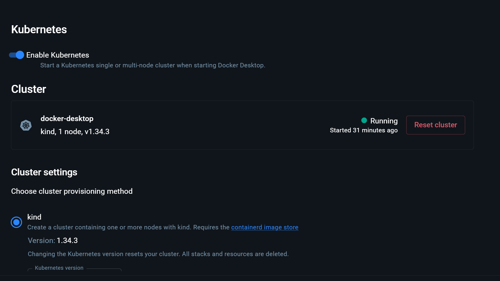

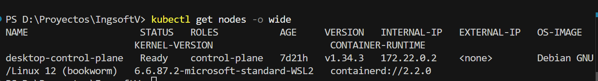

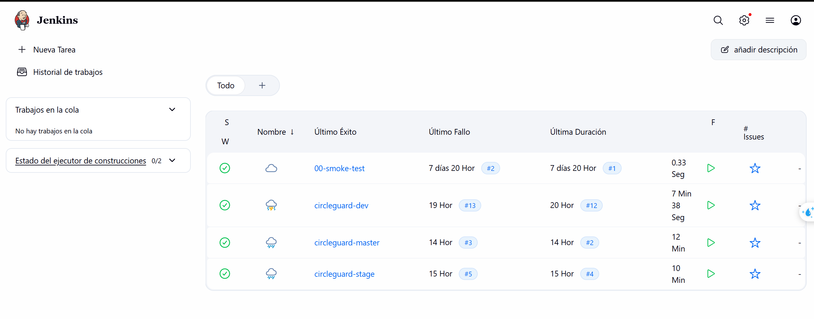

### Resultado

La validacion final fue directa: el contexto activo correspondio a docker-desktop, el namespace circleguard aparecio como Active, los pods del middleware y de los seis servicios quedaron en Running 1/1 y el contenedor de Jenkins permanecio arriba durante las ejecuciones.

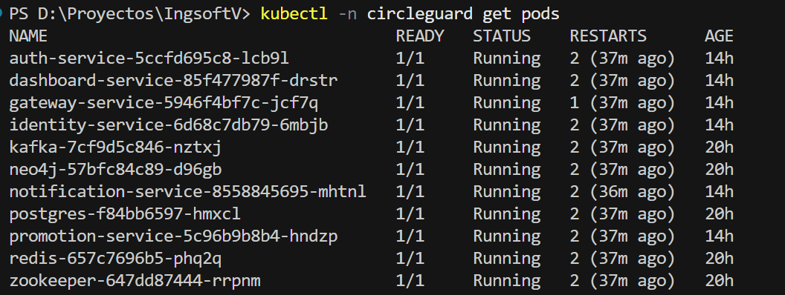

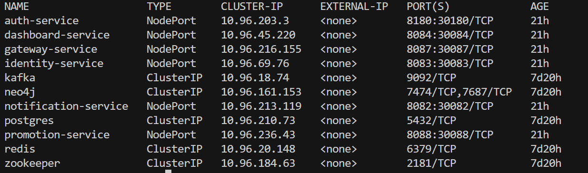

### Analisis

Usar el cluster embebido de Docker Desktop simplifico bastante el flujo, porque las imagenes construidas localmente quedaron visibles para Kubernetes sin pasos extra. La limitacion importante fue otra: los NodePort no resultaron accesibles ni desde Windows ni desde contenedores hermanos de Jenkins, y ese detalle termino condicionando el diseno de STAGE y MASTER.

---

## 2. Pipeline DEV (Punto 2 - 15%)

El pipeline DEV se orquesto desde [Jenkinsfile.dev](../../Jenkinsfile.dev). La idea fue compilar, probar, construir imagenes y desplegar en paralelo para los seis microservicios, y cerrar con una corrida E2E y una prueba corta de Locust.

| # | Stage | Funcion principal | Observacion |
|---|---|---|---|
| 1 | Checkout | traer el repositorio | usa checkout scm |
| 2 | Prepare | inicializar Gradle | calienta el wrapper |
| 3 | Build and Test | generar jar y ejecutar pruebas por servicio | publica resultados JUnit |
| 4 | Docker build | construir imagenes dev | usa el daemon compartido |
| 5 | Deploy to K8s | aplicar manifiestos y actualizar imagenes | timeout de 8 minutos |
| 6 | Smoke | comprobar conectividad entre servicios | corre dentro del cluster |
| 7 | E2E | ejecutar la suite de tests end to end | usa Gradle en el modulo tests/e2e |
| 8 | Locust smoke | correr una carga breve | genera reporte HTML y CSV |

El job en Jenkins quedo configurado como Pipeline script from SCM apuntando al mismo repositorio y usando [Jenkinsfile.dev](../../Jenkinsfile.dev) como script path.

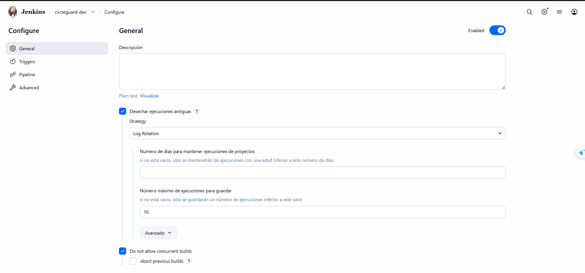

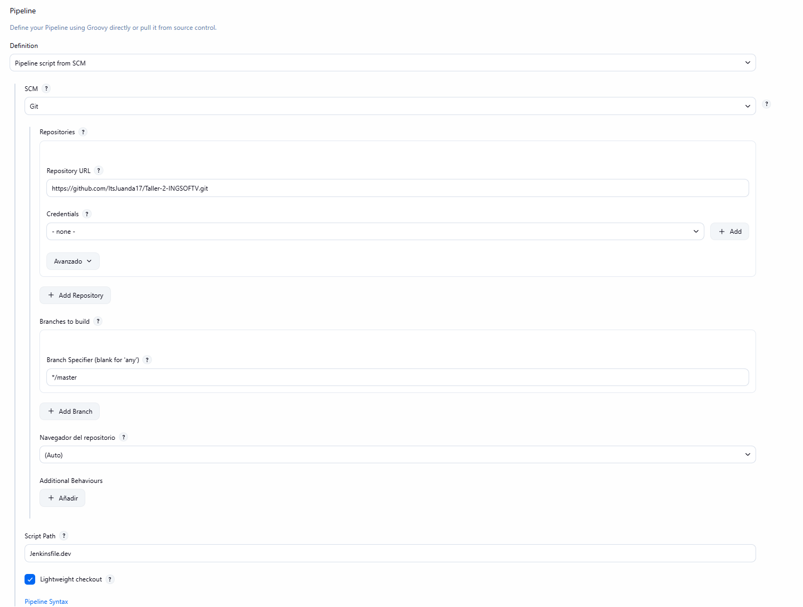

### Resultado

En la ejecucion exitosa quedaron las ocho etapas en verde, seis imagenes con tag dev, seis deployments estables en Kubernetes y los resultados de pruebas unitarias, de integracion y E2E publicados en Jenkins.

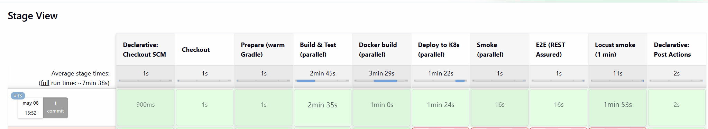

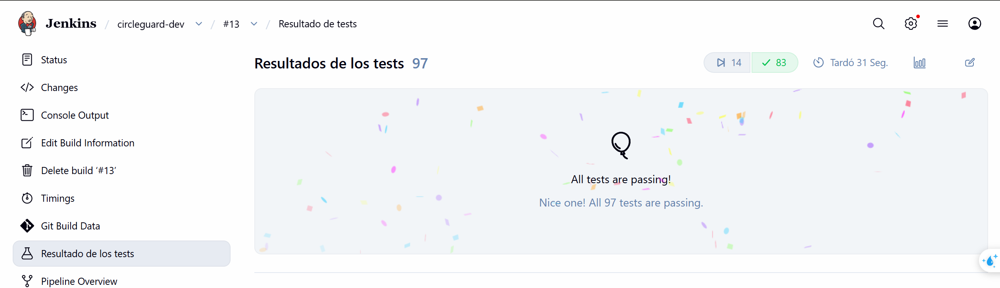

### Analisis

El primer build tomo entre 10 y 12 minutos; las ejecuciones posteriores bajaron a un rango de 3 a 4 minutos por el cache de Gradle y de Docker. El paralelismo fue util para acortar el ciclo completo, pero los tests dentro de cada servicio se mantuvieron secuenciales para no pelear por Postgres durante las integraciones. El smoke final se dejo dentro del cluster para verificar el camino real entre servicios y no una ruta artificial por host.

---

## 3. Pruebas: unit, integration, E2E y performance (Punto 3 - 30%)

### 3.1 Pruebas unitarias

Las pruebas unitarias cubren logica aislada de servicios clave.

| Servicio | Archivo | Cobertura principal |
|---|---|---|
| auth | [JwtTokenServiceTest](../../services/circleguard-auth-service/src/test/java/com/circleguard/auth/service/JwtTokenServiceTest.java) | firma, parseo y expiracion del JWT |
| auth | [QrTokenServiceTest](../../services/circleguard-auth-service/src/test/java/com/circleguard/auth/service/QrTokenServiceTest.java) | generacion y validacion del QR token |
| identity | [IdentityVaultServiceTest](../../services/circleguard-identity-service/src/test/java/com/circleguard/identity/service/IdentityVaultServiceTest.java) | cifrado AES-GCM y hash deterministico |
| promotion | [HealthStatusServiceTest](../../services/circleguard-promotion-service/src/test/java/com/circleguard/promotion/service/HealthStatusServiceTest.java) | agregacion y mapeo de estados |
| gateway | [GateValidatorTest](../../services/circleguard-gateway-service/src/test/java/com/circleguard/gateway/service/GateValidatorTest.java) | decision RED, YELLOW y GREEN sobre Redis |

Ejemplo de ejecucion local: .\gradlew :services:circleguard-auth-service:test --no-daemon

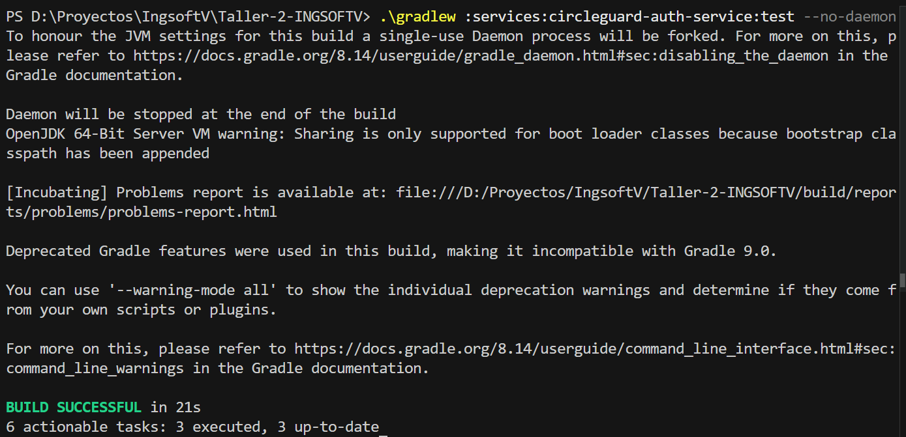

### 3.2 Pruebas de integracion

Las pruebas de integracion validan interaccion entre capas o entre servicios y middleware real o emulado.

| Servicio | Archivo | Comunicacion validada |
|---|---|---|
| identity | [IdentityControllerIntegrationTest](../../services/circleguard-identity-service/src/test/java/com/circleguard/identity/IdentityControllerIntegrationTest.java) | controller, service y Postgres con Testcontainers |
| promotion | [HealthStatusFlowIntegrationTest](../../services/circleguard-promotion-service/src/test/java/com/circleguard/promotion/HealthStatusFlowIntegrationTest.java) | publicacion en Kafka y consumo notificado |
| dashboard | [DashboardToPromotionIntegrationTest](../../services/circleguard-dashboard-service/src/test/java/com/circleguard/dashboard/DashboardToPromotionIntegrationTest.java) | llamada HTTP hacia promotion con WireMock |
| auth | [AuthLoginIntegrationTest](../../services/circleguard-auth-service/src/test/java/com/circleguard/auth/AuthLoginIntegrationTest.java) | login, emision y validacion de JWT |
| gateway | [GatewayValidateIntegrationTest](../../services/circleguard-gateway-service/src/test/java/com/circleguard/gateway/GatewayValidateIntegrationTest.java) | validacion con Redis embebido |

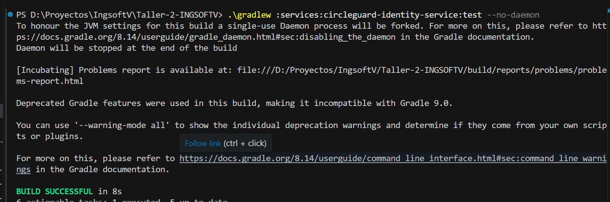

### 3.3 Pruebas E2E

Las pruebas E2E cubren recorridos completos contra los servicios desplegados en Kubernetes.

| Archivo | Tests | Flujo validado |
|---|---|---|
| [VisitorRegistrationE2ETest](../../tests/e2e/src/test/java/com/circleguard/e2e/VisitorRegistrationE2ETest.java) | 2 | registro de visitante y generacion deterministica del anonymous UUID |
| [QrToGateE2ETest](../../tests/e2e/src/test/java/com/circleguard/e2e/QrToGateE2ETest.java) | 2 | login, generacion de QR y validacion en gateway |
| [HealthBoardE2ETest](../../tests/e2e/src/test/java/com/circleguard/e2e/HealthBoardE2ETest.java) | 2 | agregacion del dashboard desde promotion |
| [BuildingAdminE2ETest](../../tests/e2e/src/test/java/com/circleguard/e2e/BuildingAdminE2ETest.java) | 2 | administracion de edificios y consulta publica |
| [IdentityLookupAuthorizationE2ETest](../../tests/e2e/src/test/java/com/circleguard/e2e/IdentityLookupAuthorizationE2ETest.java) | 1 | rechazo 401 en una consulta anonima |

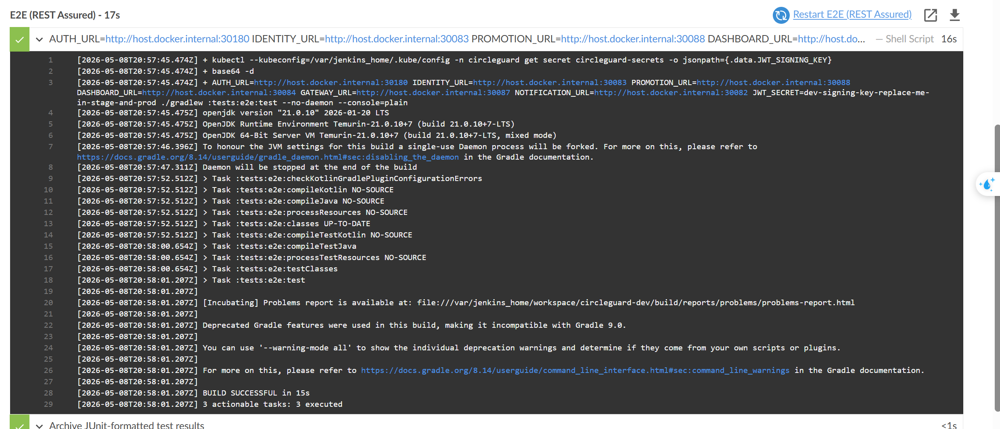

### 3.4 Pruebas de rendimiento

La suite de carga se implemento en [tests/performance/locustfile.py](../../tests/performance/locustfile.py) con un perfil de uso sencillo: validacion de QR, consulta del tablero de salud, listado de edificios y registro de visitantes. La configuracion usada en CI fue de 30 usuarios, incremento de 5 usuarios por segundo y una duracion de 5 minutos.

| Task | Peso | Endpoint |
|---|---:|---|
| validate_qr | 5 | auth /qr/generate y gateway /gate/validate |
| fetch_health_board | 3 | dashboard /health-board |
| list_buildings | 2 | promotion /buildings |
| register_visitor | 1 | identity /visitor |

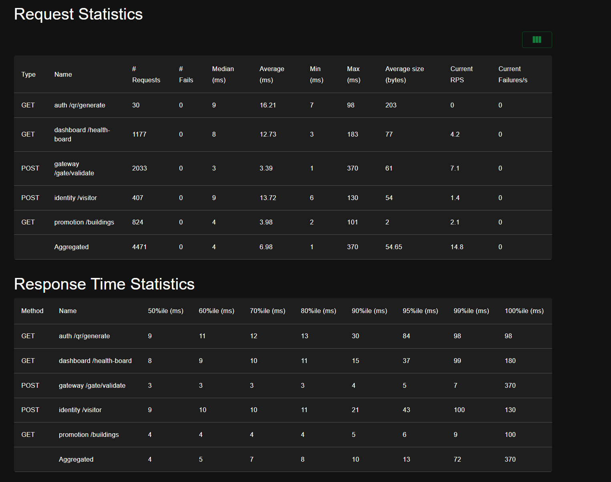

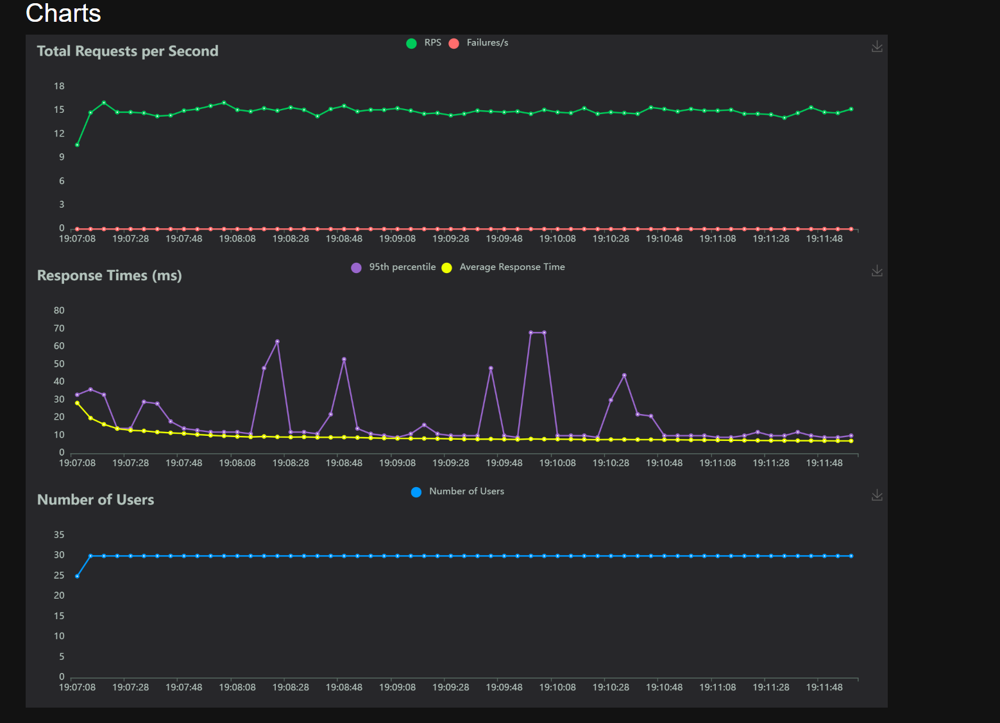

### Analisis del Punto 3

| Tipo | Cantidad nueva | Total referencial |
|---|---:|---:|
| Unit | 5 o mas | cerca de 25 |
| Integration | 5 o mas | cerca de 15 |
| E2E | 5 clases y 9 tests | 9 |
| Performance | 1 suite Locust | 1 |

Las metricas visibles en el reporte HTML archivado fueron estas:

| Metrica | Valor observado | Lectura |
|---|---|---|
| Requests totales | 4471 | volumen procesado en la corrida mostrada |
| Failures | 0 % | no hubo errores en la evidencia capturada |
| Throughput | 14.8 req/s | comportamiento sostenido para el tamano de la prueba |
| Mediana | 4 ms | latencia tipica baja |
| p95 | 13 ms | cola corta en la mayor parte de la ejecucion |
| p99 | 72 ms | sin picos severos en el agregado |

Para una ejecucion local con 30 usuarios, el resultado es comodo: la mediana quedo muy por debajo de 50 ms y el p99 muy por debajo de 500 ms. No aparecen señales de saturacion fuerte ni de agotamiento del pool de conexiones en la evidencia que quedo archivada.

---

## 4. Pipeline STAGE (Punto 4 - 15%)

El pipeline de [Jenkinsfile.stage](../../Jenkinsfile.stage) parte de DEV pero endurece la validacion: build y test mas conservadores, E2E sin saltos silenciosos y una corrida de Locust de 5 minutos ejecutada dentro del cluster.

| # | Stage | Diferencia relevante |
|---|---|---|
| 1 | Checkout | misma base de DEV |
| 2 | Prepare | misma preparacion de Gradle |
| 3 | Build and Test | secuencial para evitar saturacion del agente |
| 4 | Docker build | genera tags stage y stage por build |
| 5 | Deploy to K8s | mantiene diagnosticos en fallos de rollout |
| 6 | Smoke | se conserva la verificacion intra-cluster |
| 7 | E2E strict | sin skips, con secret real y port-forward |
| 8 | Performance test | Locust de 5 minutos dentro del cluster |

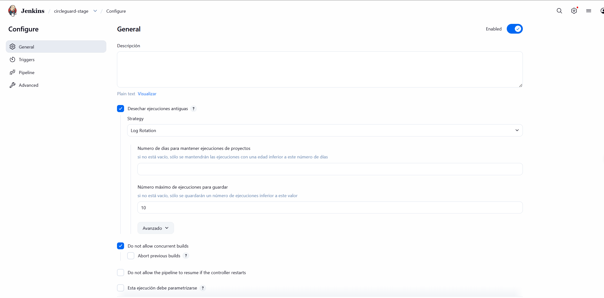

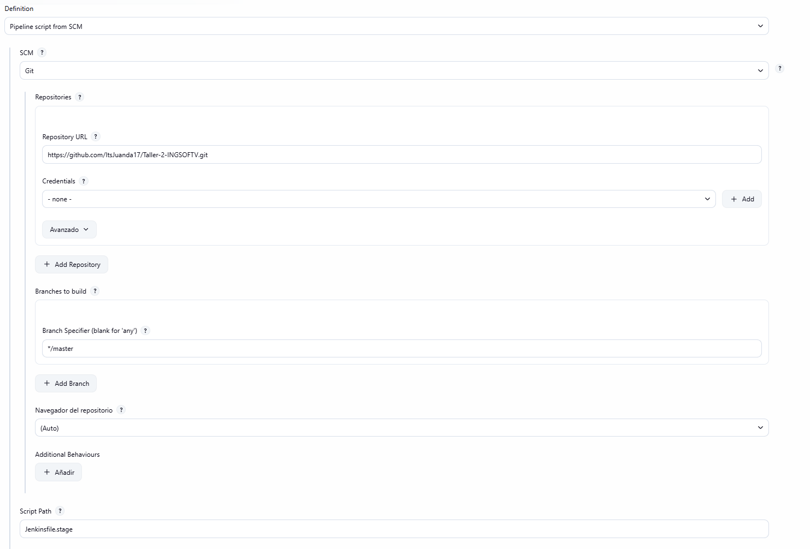

### Resultado

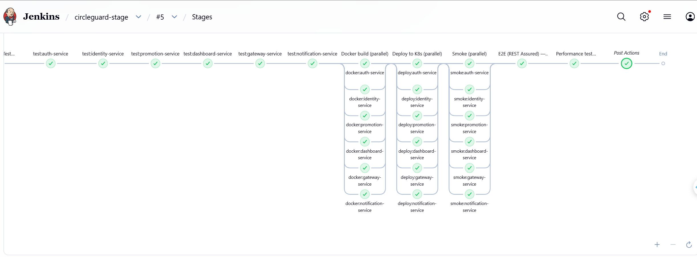

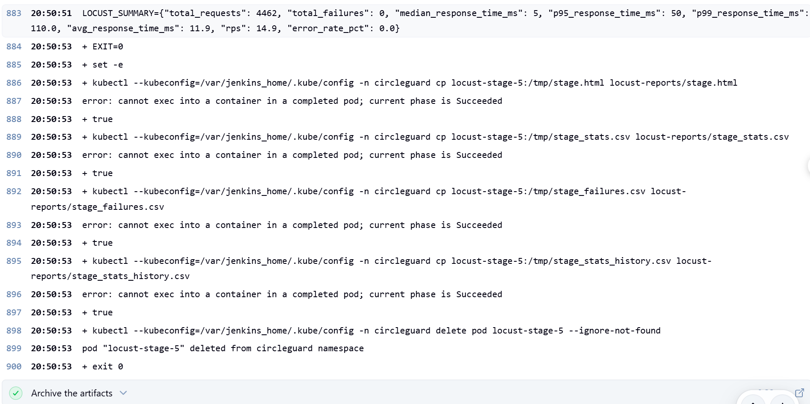

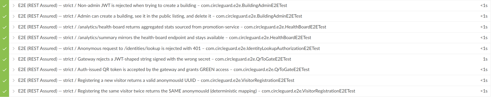

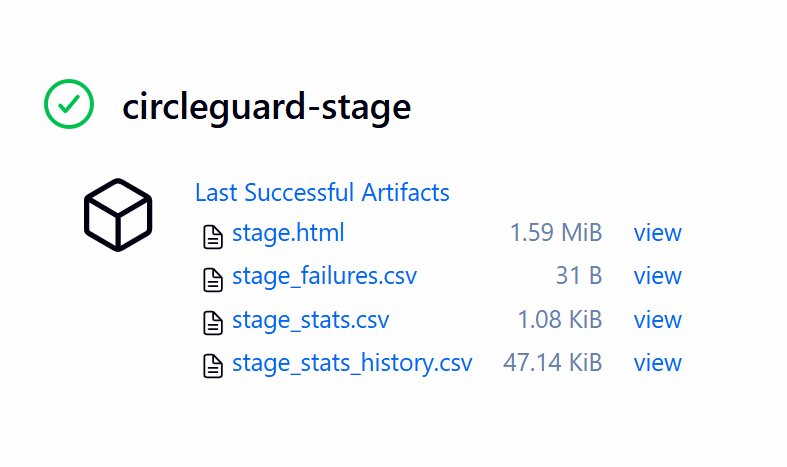

### Analisis

El tiempo total de STAGE quedo entre 17 y 22 minutos. El costo de volver secuencial la etapa de Build and Test fue aceptable porque redujo la inestabilidad del agente y evito timeouts de Testcontainers. La ejecucion in-cluster de Locust termino siendo la salida correcta, porque midio trafico real entre pods y elimino los falsos fallos causados por la red de Docker Desktop.

| Metrica | Valor | Comentario |
|---|---|---|
| Total requests | 4462 | resumen mostrado en la consola del stage |
| Total failures | 0 % | no hubo errores en la corrida archivada |
| RPS | 14.9 | carga sostenida durante 5 minutos |
| p50 | 5 ms | latencia central baja |
| p95 | 50 ms | cola controlada |
| p99 | 110 ms | sin degradacion critica |
| Endpoint con peor p99 | identity /visitor, 100 ms | fue el mas alto en el reporte HTML visible |

---

## 5. Pipeline MASTER y release notes (Punto 5 - 15%)

El pipeline de [Jenkinsfile.master](../../Jenkinsfile.master) replica las validaciones de STAGE y agrega versionado, generacion de release notes y tag del release.

| # | Stage | Funcion |
|---|---|---|
| 1 | Checkout | traer el codigo |
| 2 | Prepare | inicializar entorno |
| 3 | Build and Test | misma estrategia secuencial de STAGE |
| 4 | Docker build | generar imagenes versionadas |
| 5 | Deploy to K8s | desplegar la version del release |
| 6 | Smoke | validacion basica del despliegue |
| 7 | E2E strict | misma suite estricta de STAGE |
| 8 | Performance | misma estrategia in-cluster |
| 9 | Generate release notes | agrupar commits por tipo |
| 10 | Tag release | crear el tag anotado del release |

El versionado quedo definido como 1.0 por numero de build, con tags de imagen para master y para la version puntual. El tag de Git tambien se genera de forma automatica dentro del workspace de Jenkins. No se empujo al remoto porque eso ya exige credenciales adicionales y no hacia parte del alcance del taller.

La implementacion final de release notes no uso git-cliff. Ese intento fallo por el problema habitual de montajes cuando Jenkins corre dentro de un contenedor y usa el socket del daemon del host. La solucion fue generar el archivo directamente con git log y categorizar commits en bug fixes, tests, CI y otros cambios. El resultado archivado del ultimo release visible quedo en [images/release_notes_master/RELEASE_NOTES.md](images/release_notes_master/RELEASE_NOTES.md).

| Practica | Evidencia en el pipeline |
|---|---|
| Versionado | la imagen y el tag quedan ligados al numero de build |
| Trazabilidad | el release queda asociado a un punto concreto del historial |
| Release notes | se generan y se archivan como artefacto |
| Categorizacion de cambios | se separan fixes, tests, CI y otros cambios |
| Reproducibilidad | cada build apunta a una imagen concreta |

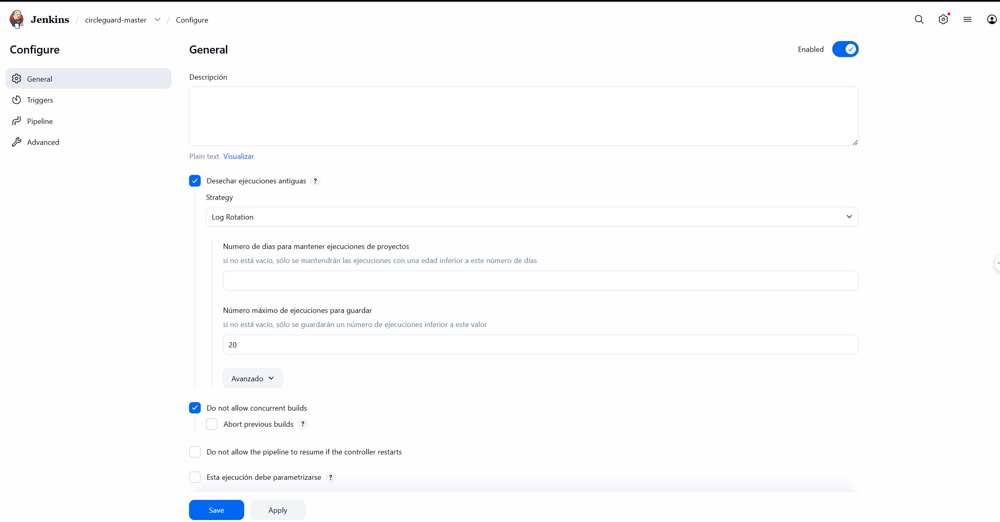

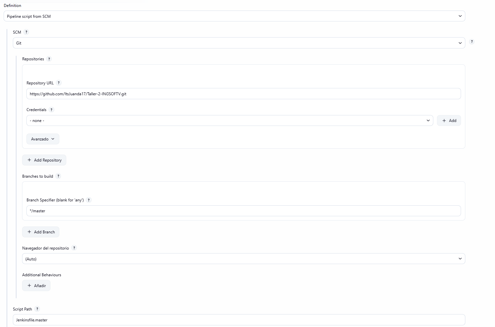

### Resultado

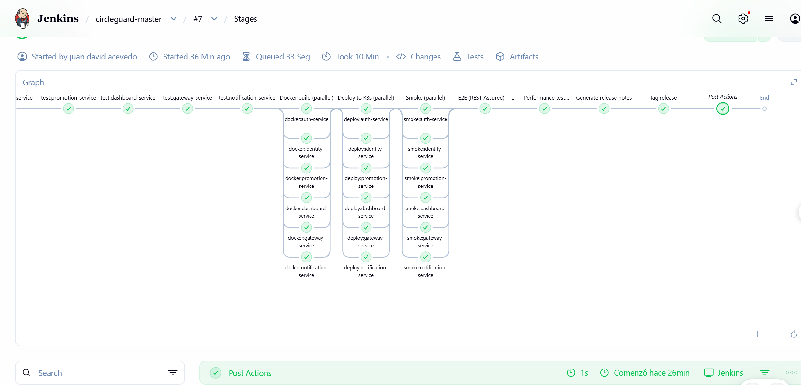

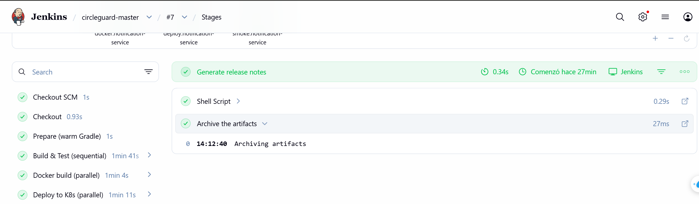

Archivo generado del release: [images/release_notes_master/RELEASE_NOTES.md](images/release_notes_master/RELEASE_NOTES.md)

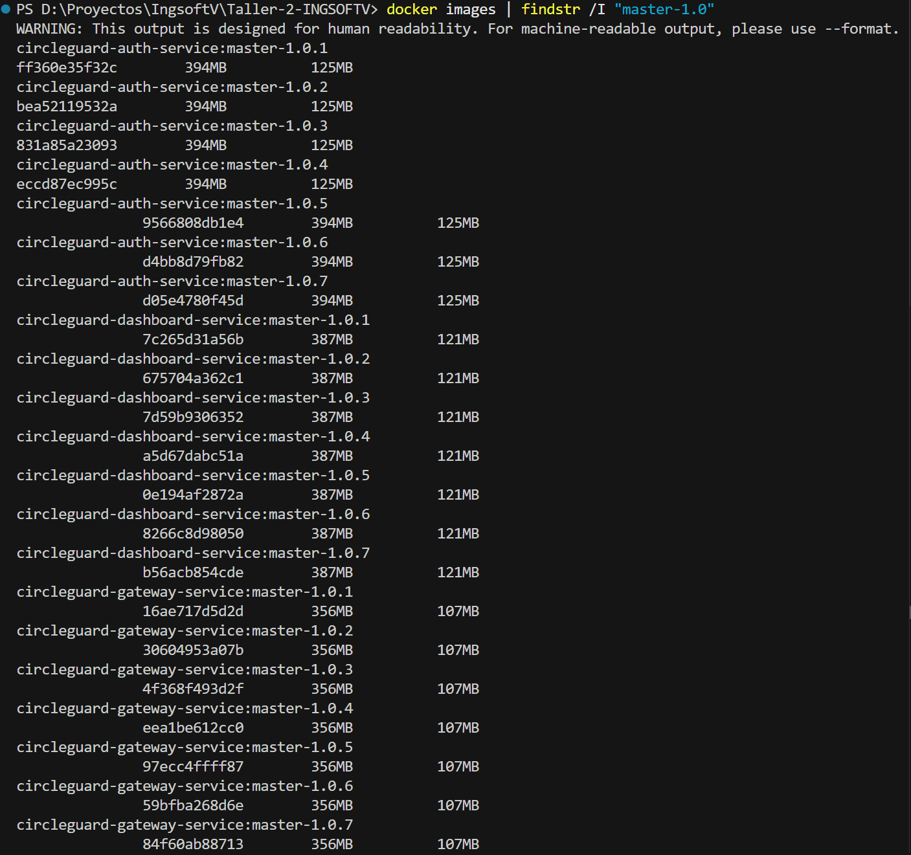

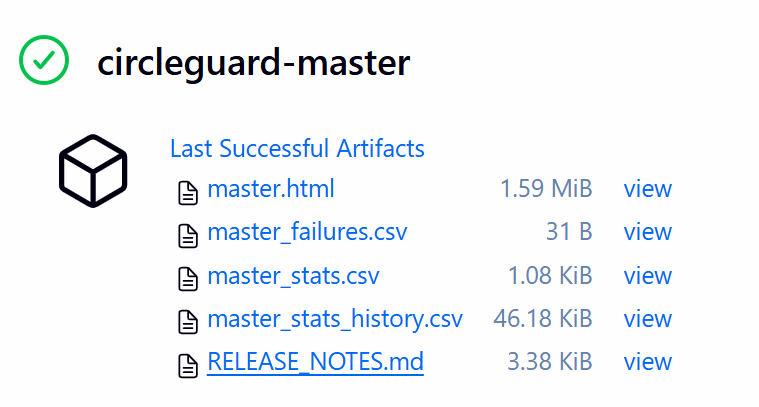

### Analisis

El aporte de MASTER frente a STAGE no estuvo en correr mas pruebas, sino en cerrar el ciclo de liberacion: dejar una version fija, producir un resumen de cambios y marcar el punto del historial. En la evidencia archivada se ve un release v1.0.7 con correcciones funcionales, endurecimiento de pruebas y ajustes de CI suficientes para reconstruir que cambio y por que.

---

## 6. Documentacion y video (Punto 6 - 15%)

La documentacion entregada en el repositorio queda concentrada en estos elementos:

- [docs/taller2/INFORME.md](INFORME.md)
- [Jenkinsfile.dev](../../Jenkinsfile.dev), [Jenkinsfile.stage](../../Jenkinsfile.stage) y [Jenkinsfile.master](../../Jenkinsfile.master)
- [infra/k8s](../../infra/k8s/)
- [tests/e2e](../../tests/e2e/)
- [tests/performance](../../tests/performance/)

### Video

Enlace del video: https://youtu.be/X-lmy1dmd4o

---

